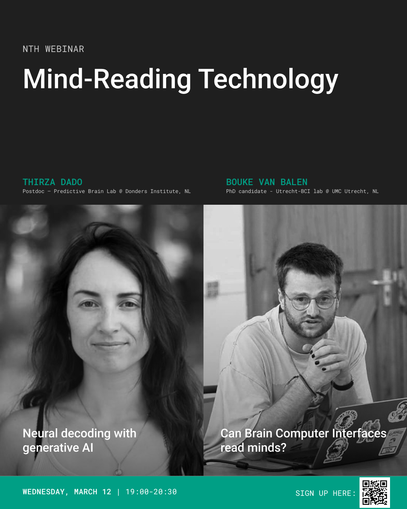

+++
title       = "Mind-Reading Technology — NTH Webinar #1 (Online)"
type        = "talks"
draft       = false

# The talks list filters on this string date (YYYY-MM-DD)
event_date  = "2025-03-12"

# Displayed on cards/sections by your theme
talk_type   = "webinar"
location    = "Online"
summary     = "Our first online webinar: Thirza Dado & Bouke van Balen on mind-reading technology, neural decoding, and whether BCIs can read minds — with live Q&A."

# Handy custom fields (optional)
# registration_link = ""
tags        = ["neurotech","webinar","BCI","online"]
featured    = false
+++

# Mind-Reading Technology

**We’re excited to share our first online event!**  
Two young researchers unpack the promise and limits of “mind-reading” with brain–computer interfaces and neural decoding.

## What to expect
- ✨ Engaging presentations from both speakers  
- 💡 Interactive discussion  
- ❓ Live audience Q&A

## Speakers
**Thirza Dado** — Postdoc, Predictive Brain Lab @ Donders Institute (NL)  
*Talk:* **Neural decoding with generative AI**

**Bouke van Balen** — PhD candidate, Utrecht-BCI Lab @ UMC Utrecht (NL)  
*Talk:* **Can Brain-Computer Interfaces read minds?**

## When & where
- **Date:** Wednesday, 12 March 2025  
- **Time:** 19:00–20:30 CET  
- **Format:** Online webinar

### Outline
- 19:00 — Welcome & intro  
- 19:05 — Talk 1: Neural decoding with generative AI  
- 19:35 — Talk 2: Can BCIs read minds?  
- 20:05 — Discussion + live Q&A  
- 20:30 — Close

## Who is this for?
Open to neurotech enthusiasts of all backgrounds — researchers, students, industry folks, or anyone curious about the future of brain technology. **Let’s connect, exchange ideas, and shape the future of neurotechnology together.**

---

