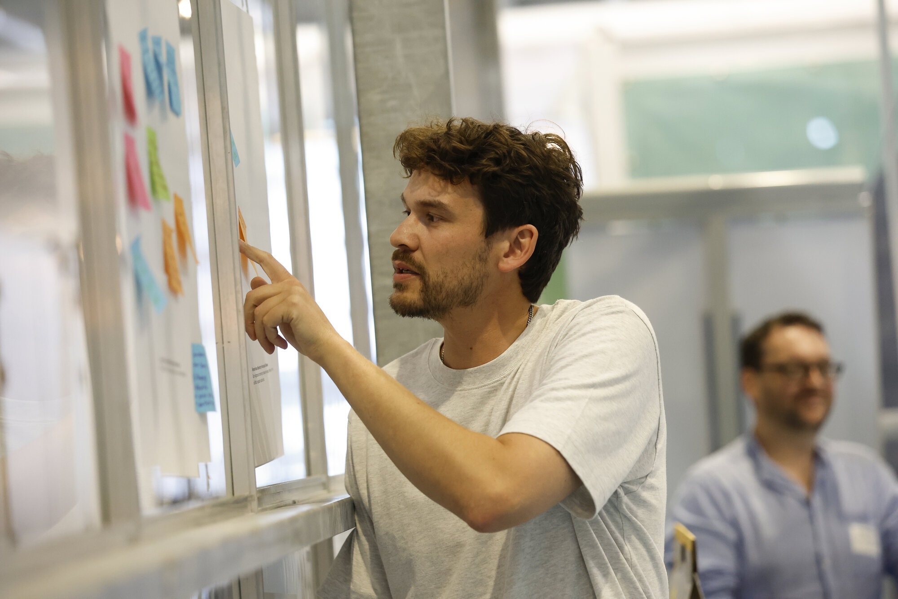
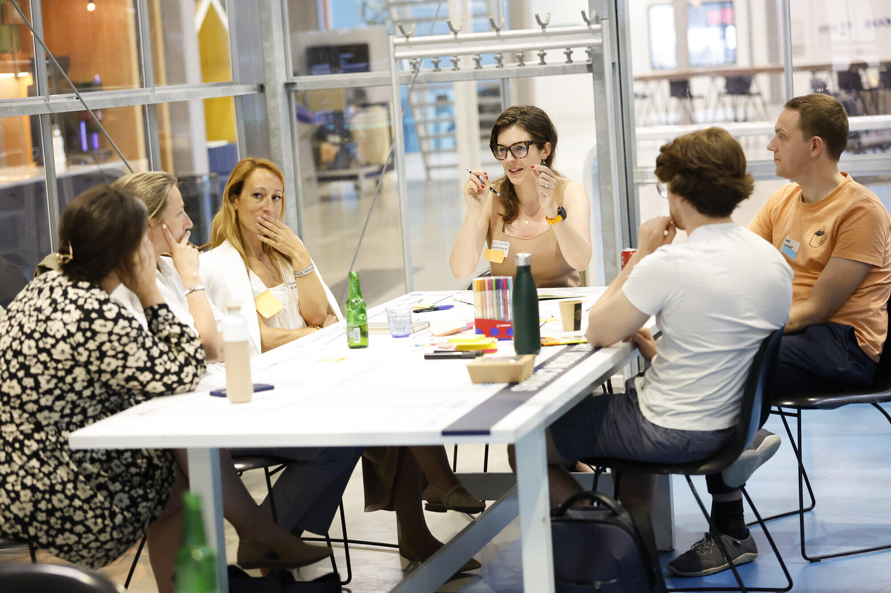
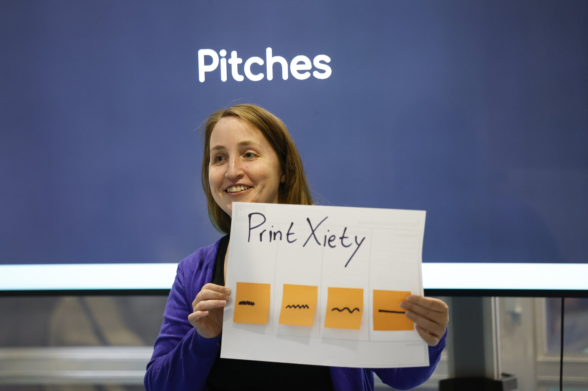
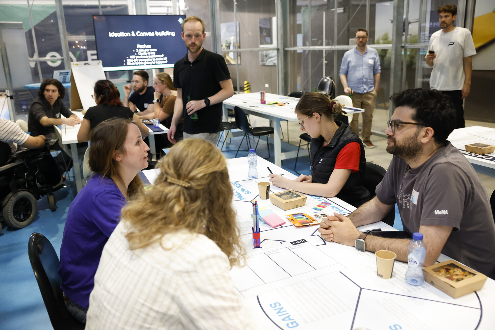
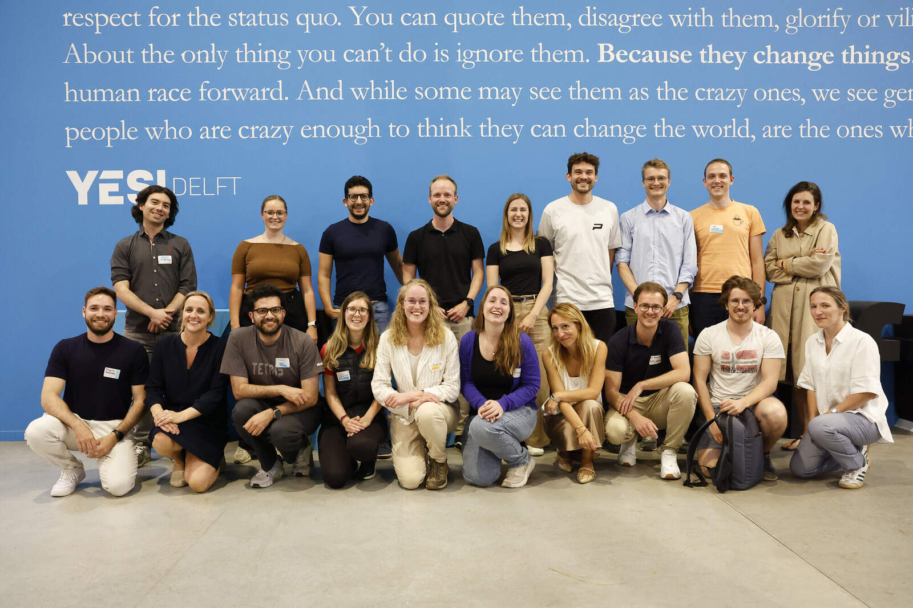

+++
title       = "TU Delft Neuro Challenge \n — Build your neuro start-up in one day"
type        = "talks"
draft       = false

# The talks list filters on this string date (YYYY-MM-DD)
event_date  = "2025-06-18"

# Displayed on cards/sections by your theme
talk_type   = "challenge"
location    = "YES!Delft, Molengraaffsingel 12, 2629 JD Delft"
summary     = "One-day, hands-on challenge to turn neurotech ideas into startup concepts — with keynotes, team sprints, and a jury pitch."

# Handy custom fields (optional)
# registration_link = "https://www.aanmelder.nl/166561/home"
tags        = ["neurotech","startup","workshop","in person"]
featured    = false
+++

# TU Delft Neuro Challenge

**Take your neurotech idea to the next level — and help shape the future of brain innovation.**

Join a one-day, hands-on event where young scientists, clinicians, engineers, and students co-create startup concepts in neurotechnology. Whether you bring your own idea or want to contribute to someone else’s, everyone’s welcome.

## What to expect
- **Keynote:** Nicolas Vachicouras (CEO & Co-founder, NeuroSoft Bioelectronics)  
- **Keynote:** Dr. Stephen Rainey (ethics in neurotechnology)  
- **Startup crash-course:** practical tools & mentoring  
- **Team sprint:** build, iterate, and validate your concept  
- **Pitch to an expert jury:** prize for the winning team 🎉

### When & where
- **Date:** 18 June 2025  
- **Location:** YES!Delft — Molengraaffsingel 12, 2629 JD Delft

### Register
👉 **Sign up here:** [aanmelder.nl/166561](https://www.aanmelder.nl/166561/home)

---

## Event Summary

The TU Delft Neurochallenge at **YES!Delft** brought together a vibrant mix of young neuroscientists, medics, students, and interdisciplinary researchers — all with one shared mission: turn bold neurotech ideas into real-world solutions.

We kicked off with two inspiring keynotes:
- **Nicolas Vachicouras** (Co-founder & CEO, Neurosoft Bioelectronics) on building neuromodulation startups and translating innovation from lab to clinic.
- **Dr. Stephen Rainey** (Assistant Professor of Philosophy & Technology, TU Delft) on ethics and neurophilosophy — the responsibilities that come with technology interfacing the brain.

Fueled by those talks, participants jumped into a high-pressure **innovation sprint**. The energy, collaboration, and creativity of mixed-background teams (from engineering students to architects and entrepreneurs) really showed what’s possible when disciplines meet.

### Winning concept: PrintXiety
**PrintXiety** proposed a beautiful fusion of empathy and engineering: use **EEG** to track mental-health progress (e.g., anxiety reduction) and **translate those data into 3D-printed structures**. The resulting objects make psychological change **tangible** — from *chaotic to calm*, *rough to smooth* — so patients and clinicians can literally see and feel progress.

This NeuroTechHub initiative was led by **Francesc Varkevisser**, **Stijn Balk**, **Antonio Manuel Lozano Ortega**, and **Patricija Burgar** — and we’re only just getting started. The event was part of the national **Hersencampagne**, supporting brain research and innovation across the Netherlands.

**Special thanks** to: Martine van Diepenbrugge, Fien Bosman-van Gelder, Janneke den Besten-van Ravenswaaij, Daan Kuitenbrouwer, Rick Bonants, Claire Visser, **TU Delft | EEMCS**, and — most of all — to all participants for your energy and creativity.

Want to help shape the future of brain-tech? **Reach out — we’d love to hear from you.**

  
  
  
  
  
  
  

